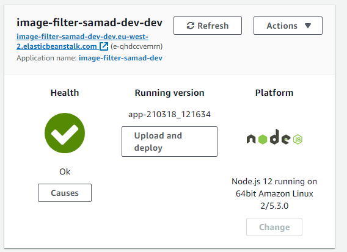
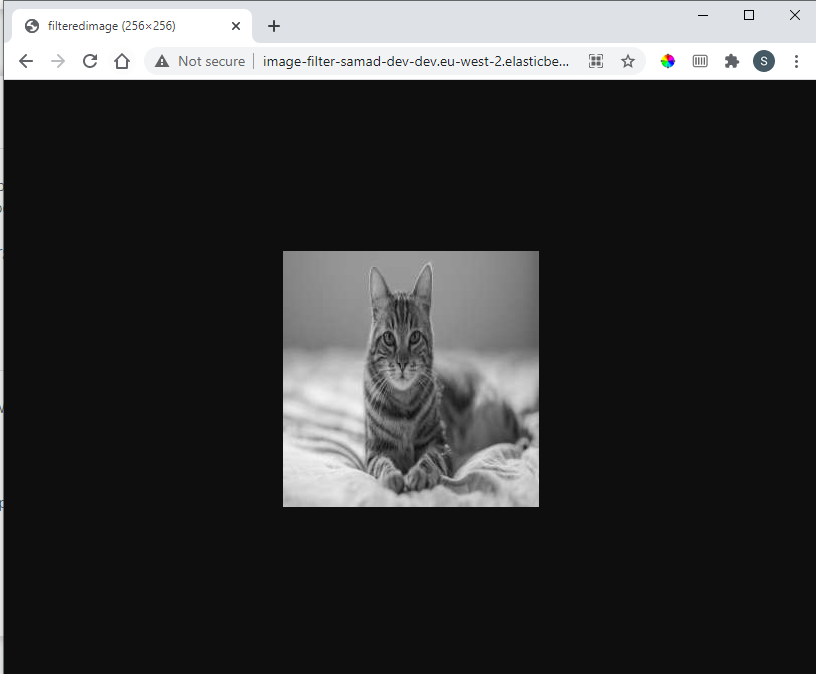

# Deploy Full Stack App in the Cloud

Cloud URL:

http://image-filter-samad-dev-dev.eu-west-2.elasticbeanstalk.com/

Example usage:

http://image-filter-samad-dev-dev.eu-west-2.elasticbeanstalk.com/filteredimage?image_url=https://upload.wikimedia.org/wikipedia/commons/b/bd/Golden_tabby_and_white_kitten_n01.jpg

1. Elastic Beanstalk app is deployed.

2. Cloud is filtering images successfully.

Original Image:

Filtered Image:

